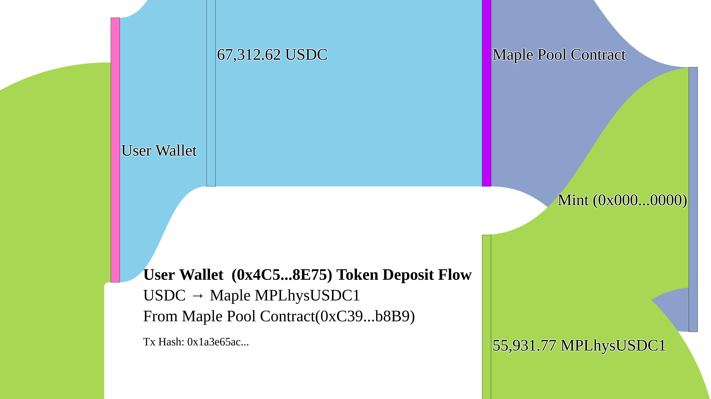

# 📘 SoK: Stablecoins for Digital Transformation

### 🧠 Design, Metrics, and Application with Real World Asset Tokenization as a Case Study

---

## 🧭 Overview

This repository contains the **replication materials** for the study:

> **“SoK: Stablecoins for Digital Transformation — Design, Metrics, and Application with Real World Asset Tokenization as a Case Study”**

All code, data references, and figures are included to support **transparent, reproducible research** in the Web3 spirit of open science. 

---

## 📂 Repository Structure

| Path / File                  | Description                                                                 |
|-----------------------------|-----------------------------------------------------------------------------|
| `notebooks/`                | 📒 Main Colab/Notebook containing analysis and visualizations                |
| `data/`                     | 📁 Raw and/or pre-processed data files                                      |
| `figures/`                  | 📊 High-resolution figures used in the paper                                |
| `scripts/`                  | 🛠️ Supporting Python utilities and API integration                         |
| `README.md`                 | 📘 Documentation (you are here)                                             |

---

## 🚀 How to Run

To reproduce results:

1. Download the repository.
2. Open `notebooks/stablecoin_sok_analysis.ipynb` (via Colab or Jupyter).
3. Insert your API credentials (see below).
4. Execute the notebook end-to-end.

---

## 🔧 Requirements

Install all required Python packages using:

```bash
pip install -r requirements.txt
````

---

## 🔑 Required APIs and Tools

| Tool/Service         | Purpose                                           | Emoji/Icon |
| -------------------- | ------------------------------------------------- | ---------- |
| 🧪 `CoinMetrics API` | Market and blockchain metrics for stablecoins     | 📈📉       |
| 🔌 `Alchemy`         | Ethereum RPC access for contract calls            | ⛓️🧙       |
| 🌐 `web3.py`         | Blockchain interaction and ABI decoding           | ⚙️🧩       |
| 📊 `Plotly`          | High-res, journal-quality charts and Sankey flows | 📉🖼️      |
| 📑 `pandas`          | Data cleaning, transformation and aggregation     | 📂📋       |

All dependencies are annotated and explained line-by-line in the notebook.

---

## 🖼️ Example Figure

<div align="center">



*Figure: Circular Sankey Diagram of USDC → Maple → LP Token*

</div>

Figures are styled for **Publication standards** with:

* 🖋️ Times New Roman fonts
* 🎨 Harmonized, high-contrast pastel color palettes
* 🧭 Directional arrows
* 🪞 Clear node labels and annotations
* ✅ Export-ready high-res vector (PNG)


---

## 🧪 Reproducibility Commitment

We follow best practices for scientific reproducibility:

* ✅ All figures and tables generated from notebook.
* ✅ External API sources are explicitly cited.
* ✅ Plots and raw data are reproducible from source.

---

## 📬 Contact & Contributions

Feel free to:

* 📝 Submit an issue
* 📥 Open a pull request
* ✉️ Contact the authors directly

---

<p align="center">
  <b>Made with ⛓️ Blockchain, 📊 data, and 💡 research</b>
</p>
```
